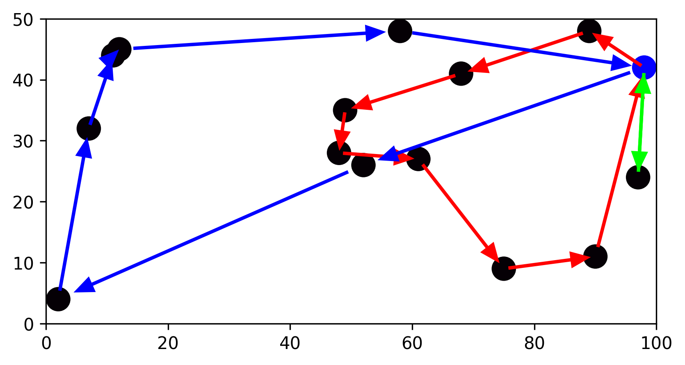

# Roterizacao-de-veiculos

## Como rodar:

Crie um ambiente .venv utilizando o comando

```bash
python -m venv .venv
```

Instale as dependencias

```bash
python install -r requirements.txt
```

## Como usar

### Otimizar

utilize o comando

```bash
python main.py
```

Isso vai gerar uma instancia com pontos aleatórios no qual um representa o deposito e os outros representam os clientes. 


### Visualizar solução
Após otimizar, será mostrado um gráfico mostrando um mapa com as posições dos clientes, deposito e o caminho percorrido por cada veículo.

Exemplo de solução


